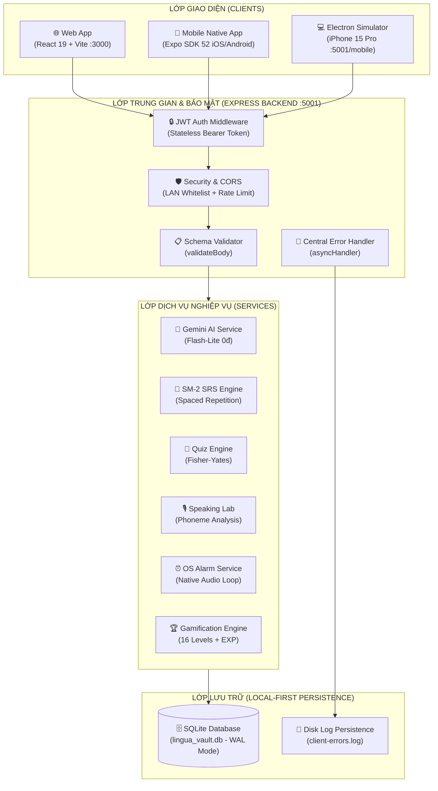

# 🏛️ LinguaVault - Technical Architecture & API Specification

Tài liệu thiết kế kiến trúc kỹ thuật chi tiết, lược đồ cơ sở dữ liệu SQLite, đặc tả API RESTful và thuật toán lõi của hệ sinh thái LinguaVault 2.0.

---

## 📑 Mục Lục
1. [Kiến Trúc Tổng Thể & Tech Stack](#1-kiến-trúc-tổng-thể--tech-stack)
2. [Lược Đồ Cơ Sở Dữ Liệu SQLite (Database Schema)](#2-lược-đồ-cơ-sở-dữ-liệu-sqlite-database-schema)
3. [Thuật Toán Lõi & Động Cơ Nghiệp Vụ](#3-thuật-toán-lõi--động-cơ-nghiệp-vụ)
   - [3.1 Thuật toán Spaced Repetition (SuperMemo SM-2)](#31-thuật-toán-spaced-repetition-supermemo-sm-2)
   - [3.2 Động cơ Sinh Đề AI & Xáo Trộn Ngẫu Nhiên (Fisher-Yates)](#32-động-cơ-sinh-đề-ai--xáo-trộn-ngẫu-nhiên-fisher-yates)
   - [3.3 Hệ thống Đánh Giá Phát Âm AI & IELTS Speaking Band Score](#33-hệ-thống-đánh-giá-phát-âm-ai--ielts-speaking-band-score)
   - [3.4 Động Cơ Âm Thanh Đa Tầng Native iOS & Web Audio](#34-động-cơ-âm-thanh-đa-tầng-native-ios--web-audio)
   - [3.5 Báo Thức Kỷ Luật Cấp Hệ Điều Hành (Hardcore OS Alarm)](#35-báo-thức-kỷ-luật-cấp-hệ-điều-hành-hardcore-os-alarm)
4. [Đặc Tả REST API Endpoints Reference](#4-đặc-tả-rest-api-endpoints-reference)
5. [Quy Chuẩn Bảo Mật & Local-First Privacy](#5-quy-chuẩn-bảo-mật--local-first-privacy)

---

## 1. Kiến Trúc Tổng Thể & Tech Stack

### 1.1 Multi-Tier Monorepo
- **Backend (API Server)**: Node.js v18+ / Express.js Modular Architecture / `better-sqlite3` (Native C++ SQLite bindings, synchronous zero-overhead queries, WAL mode).
- **Web Frontend**: React 19 / Vite / Lucide Icons / Canvas Confetti / CSS Variables Glassmorphism Design System.
- **Mobile Client**: React Native / Expo SDK 52 / Native `expo-speech` (`AVSpeechSynthesizer`) / `expo-av` / Vector Icons.
- **Desktop Client**: Electron 34+ / Multi-Window App & iPhone 15 Pro Touch Simulator Window.
- **AI Acceleration**: Google Gemini Flash-Lite (`gemini-flash-lite-latest`, `gemini-3.5-flash-lite`) với độ trễ phản hồi < 3.5s.



---

## 2. Lược Đồ Cơ Sở Dữ Liệu SQLite (Database Schema)

Cơ sở dữ liệu được lưu trữ nguyên bản tại `server/data/lingua_vault.db`.

```sql
-- 1. Bảng Tài Khoản Người Dùng (users)
CREATE TABLE IF NOT EXISTS users (
  id TEXT PRIMARY KEY,
  username TEXT NOT NULL UNIQUE,
  password_hash TEXT NOT NULL,
  full_name TEXT NOT NULL,
  role TEXT DEFAULT 'user',           -- 'admin' | 'user' | 'guest'
  avatar TEXT,
  created_at TEXT NOT NULL,
  updated_at TEXT NOT NULL
);

-- 2. Bảng Kho Từ Vựng (words)
CREATE TABLE IF NOT EXISTS words (
  id TEXT PRIMARY KEY,
  user_id TEXT REFERENCES users(id),
  word TEXT NOT NULL,
  phonetic TEXT,
  audio_url TEXT,
  meaning_vi TEXT NOT NULL,
  meaning_en TEXT,
  part_of_speech TEXT,
  level TEXT DEFAULT 'B2',           -- A1, A2, B1, B2, C1, C2
  topic TEXT DEFAULT 'general',
  collocations TEXT DEFAULT '[]',     -- JSON Array: ["take for granted", ...]
  examples TEXT DEFAULT '[]',         -- JSON Array: [{"en": "...", "vi": "..."}]
  tags TEXT DEFAULT '[]',             -- JSON Array: ["work", "ielts"]
  repetition INTEGER DEFAULT 0,
  interval INTEGER DEFAULT 0,
  ease_factor REAL DEFAULT 2.5,
  due_date TEXT,                      -- YYYY-MM-DD
  status TEXT DEFAULT 'new',          -- new, learning, review, mastered
  created_at TEXT NOT NULL,
  updated_at TEXT NOT NULL
);

-- 3. Bảng Mẫu Câu & Cấu Trúc (patterns)
CREATE TABLE IF NOT EXISTS patterns (
  id TEXT PRIMARY KEY,
  user_id TEXT REFERENCES users(id),
  name TEXT NOT NULL,
  formula TEXT NOT NULL,
  explanation TEXT,
  meaning_vi TEXT NOT NULL,
  category TEXT DEFAULT 'emphasis',   -- 10 communicative categories
  tone TEXT DEFAULT 'Neutral',        -- Academic, Business, Conversational
  examples TEXT DEFAULT '[]',         -- JSON Array
  tags TEXT DEFAULT '[]',
  repetition INTEGER DEFAULT 0,
  interval INTEGER DEFAULT 0,
  ease_factor REAL DEFAULT 2.5,
  due_date TEXT,
  status TEXT DEFAULT 'new',
  created_at TEXT NOT NULL,
  updated_at TEXT NOT NULL
);

-- 4. Bảng Chủ Đề Từ Vựng (topics)
CREATE TABLE IF NOT EXISTS topics (
  id TEXT PRIMARY KEY,
  user_id TEXT REFERENCES users(id),
  name TEXT NOT NULL,
  emoji TEXT DEFAULT '🏷️',
  color TEXT DEFAULT '#38bdf8',
  description TEXT,
  word_count INTEGER DEFAULT 0,
  created_at TEXT NOT NULL
);

-- 5. Bảng Nhóm Chức Năng Mẫu Câu (pattern_categories)
CREATE TABLE IF NOT EXISTS pattern_categories (
  id TEXT PRIMARY KEY,
  user_id TEXT REFERENCES users(id),
  name TEXT NOT NULL,
  name_vi TEXT NOT NULL,
  emoji TEXT DEFAULT '🧩',
  description TEXT,
  created_at TEXT NOT NULL
);

-- 6. Bảng Ghi Chú & Smart Reader (notes)
CREATE TABLE IF NOT EXISTS notes (
  id TEXT PRIMARY KEY,
  user_id TEXT REFERENCES users(id),
  title TEXT NOT NULL,
  content TEXT NOT NULL,
  tags TEXT DEFAULT '[]',
  linked_words TEXT DEFAULT '[]',
  created_at TEXT NOT NULL,
  updated_at TEXT NOT NULL
);

-- 7. Bảng Kho Đề Thi & Lịch Sử Quiz (quiz_history)
CREATE TABLE IF NOT EXISTS quiz_history (
  id TEXT PRIMARY KEY,
  user_id TEXT REFERENCES users(id),
  title TEXT NOT NULL,
  type TEXT DEFAULT 'vocab',          -- vocab | pattern
  is_ai INTEGER DEFAULT 0,            -- 0: offline | 1: AI generated
  topic TEXT DEFAULT 'All',
  category TEXT DEFAULT 'all',
  level TEXT DEFAULT 'all',
  mode TEXT DEFAULT 'mixed',
  questions TEXT NOT NULL,            -- JSON Array of Question Objects
  total_questions INTEGER DEFAULT 0,
  attempts_count INTEGER DEFAULT 0,
  best_score REAL DEFAULT 0,
  last_attempt_at TEXT,
  created_at TEXT NOT NULL,
  updated_at TEXT NOT NULL
);

-- 8. Bảng Gamification & Bậc Thang Cấp Độ (user_gamification & user_streaks)
CREATE TABLE IF NOT EXISTS user_gamification (
  user_id TEXT PRIMARY KEY REFERENCES users(id),
  total_xp INTEGER DEFAULT 0,
  current_level INTEGER DEFAULT 1,
  title TEXT DEFAULT 'Novice Scholar',
  rank_tier TEXT DEFAULT 'Bronze',
  updated_at TEXT NOT NULL
);

CREATE TABLE IF NOT EXISTS user_streaks (
  user_id TEXT PRIMARY KEY REFERENCES users(id),
  streak_days INTEGER DEFAULT 0,
  last_study_date TEXT,
  freeze_count INTEGER DEFAULT 0,
  updated_at TEXT NOT NULL
);
```

---

## 3. Thuật Toán Lõi & Động Cơ Nghiệp Vụ

### 3.1 Thuật toán Spaced Repetition (SuperMemo SM-2)
Áp dụng công thức chuẩn SuperMemo SM-2 cho từng thẻ nhớ khi người dùng đánh giá mức độ ghi nhớ (Rating từ 0 đến 5):
$$\text{EF}' = \text{EF} + (0.1 - (5 - q) \cdot (0.08 + (5 - q) \cdot 0.02))$$
Trong đó:
- $q$: Điểm đánh giá (0 = Hoàn toàn quên, 3 = Nhớ khó khăn, 5 = Nhớ hoàn hảo).
- $\text{EF}' \ge 1.3$: Hệ số độ dễ tối thiểu (Ease Factor).
- Khoảng cách ngày lặp lại:
  $$I(1) = 1 \text{ ngày}, \quad I(2) = 6 \text{ ngày}, \quad I(n) = I(n-1) \cdot \text{EF}'$$

### 3.2 Động cơ Sinh Đề AI & Xáo Trộn Ngẫu Nhiên (Fisher-Yates)
1. **Model Hierarchy**: Ưu tiên `gemini-flash-lite-latest` (800ms) ➔ `gemini-3.5-flash-lite` (900ms) ➔ `gemini-3.1-flash-lite` (1200ms) ➔ `gemini-2.5-flash` (1500ms).
2. **Fisher-Yates Shuffle**: Đảm bảo vị trí đáp án đúng luôn phân bố ngẫu nhiên đều đặn trên 4 vị trí $A, B, C, D$:
```javascript
function shuffleArray(opts) {
  for (let i = opts.length - 1; i > 0; i--) {
    const j = Math.floor(Math.random() * (i + 1));
    [opts[i], opts[j]] = [opts[j], opts[i]];
  }
  return opts;
}
```
3. **Smart Fallback Engine**: Tự động chuyển đổi sang bộ sinh đề offline nếu API bên ngoài gặp sự cố mạng hoặc Rate Limit (HTTP 429).

### 3.3 Hệ thống Đánh Giá Phát Âm AI & IELTS Speaking Band Score
- Trích xuất bảng âm vị IPA, so khớp độ chính xác phát âm (Phoneme Accuracy).
- Chấm điểm Speaking 4 tiêu chí chuẩn IELTS: Fluency & Coherence, Lexical Resource, Grammatical Range & Accuracy, Pronunciation (Band 1.0 - 9.0).

### 3.4 Động Cơ Âm Thanh Đa Tầng Native iOS & Web Audio
- **Tầng 1 (iOS Native Speech)**: Dùng `expo-speech` (`AVSpeechSynthesizer` của Apple) với giọng Siri tự nhiên, không trễ, chạy offline 100%.
- **Kích hoạt Chế độ Im lặng (Silent Mode)**: Gọi `Audio.setAudioModeAsync({ playsInSilentModeIOS: true })` đảm bảo phát âm thanh ngay cả khi người dùng gạt nút im lặng / rung trên iPhone.
- **Tầng 2 (Native Audio Stream)**: Dùng `expo-av` (`Audio.Sound`) phát trực tiếp luồng MP3 từ `/api/audio/tts`.
- **Tầng 3 & 4 (Web & Electron)**: HTML5 `new Audio(...)` và Web Speech Synthesis API.

### 3.5 Báo Thức Kỷ Luật Cấp Hệ Điều Hành (Hardcore OS Alarm)
- Kích hoạt chuông báo thức liên tục phát ra loa hệ thống khi đến giờ học.
- Bắt buộc người dùng phải hoàn thành đúng 100% nhiệm vụ trả lời câu hỏi mới cho phép tắt chuông (`/api/alarm/stop`).

---

## 4. Đặc Tả REST API Endpoints Reference

### 4.1 Xác Thực & Người Dùng (Auth & Profile)
- `POST /api/auth/register`: Đăng ký tài khoản mới (`username`, `password`, `full_name`).
- `POST /api/auth/login`: Đăng nhập cấp phát JWT Token (`admin` / `123456`).
- `POST /api/auth/guest-login`: Đăng nhập 1-chạm trải nghiệm khách.
- `GET /api/auth/me`: Lấy thông tin tài khoản hiện tại qua Bearer Token.
- `PUT /api/auth/profile`: Cập nhật thông tin cá nhân.
- `POST /api/auth/logout`: Đăng xuất (xóa token client).

### 4.2 Kho Từ Vựng (Vocabulary)
- `GET /api/vocab`: Lấy danh sách từ vựng (hỗ trợ `search`, `topic`, `level`, phân trang).
- `GET /api/vocab/lookup?word=...`: Tra từ điển AI trực tuyến (IPA, audio, nghĩa, ví dụ).
- `GET /api/vocab/stats/overview`: Thống kê tổng quan kho từ và tiến độ SRS.
- `GET /api/vocab/:id`: Lấy chi tiết 1 từ vựng.
- `POST /api/vocab`: Thêm từ vựng mới vào kho cá nhân.
- `PUT /api/vocab/:id`: Cập nhật từ vựng.
- `DELETE /api/vocab/:id`: Xóa từ vựng.

### 4.3 Mẫu Câu & Cấu Trúc (Patterns & Categories)
- `GET /api/patterns`: Lấy danh sách mẫu câu (lọc theo `category`, `tone`).
- `GET /api/patterns/:id`: Chi tiết mẫu câu.
- `POST /api/patterns`: Tạo mẫu câu mới.
- `PUT /api/patterns/:id`: Cập nhật mẫu câu (partial update).
- `DELETE /api/patterns/:id`: Xóa mẫu câu.
- `GET /api/pattern-categories`: Danh sách 10 nhóm chức năng giao tiếp.

### 4.4 Thuật Toán Ôn Tập SRS (Spaced Repetition)
- `GET /api/srs/due`: Lấy danh sách thẻ từ vựng & mẫu câu đến hạn ôn hôm nay.
- `POST /api/srs/review`: Gửi kết quả chấm điểm ghi nhớ (Rating $0 - 5$) để cập nhật lịch ôn tập.

### 4.5 Trung Tâm Thi Đấu Quiz (Quiz Center)
- `POST /api/quiz/generate`: Tạo bộ đề trắc nghiệm (offline / AI, số lượng, chủ đề).
- `POST /api/quiz/submit`: Nộp bài thi, tính điểm, ghi nhận EXP và lưu lịch sử.
- `GET /api/quiz/history`: Lấy danh sách lịch sử các bộ đề đã tạo.
- `GET /api/quiz/history/:id`: Xem lại chi tiết kết quả hoặc chuẩn bị làm lại đề.

### 4.6 AI Speaking Lab & Smart Reader
- `POST /api/speaking/analyze`: Phân tích âm thanh ghi âm, chấm điểm phát âm & ngữ điệu.
- `POST /api/speaking/ielts-qa`: Chấm điểm câu trả lời IELTS Speaking theo thang điểm 9.0.
- `GET /api/audio/tts?text=...&lang=...`: Stream luồng MP3 giọng đọc chuẩn HD.

### 4.7 Gamification & Bậc Thang Cấp Độ
- `GET /api/gamification/profile`: Lấy điểm EXP, cấp độ hiện tại và bảng 16 bậc thang.
- `POST /api/gamification/add-xp`: Cộng điểm kinh nghiệm EXP theo hành động học tập.

### 4.8 Báo Thức Hệ Điều Hành (OS Alarm)
- `POST /api/alarm/trigger`: Kích hoạt chuông báo thức.
- `GET /api/alarm/status`: Kiểm tra trạng thái báo thức đang kêu (`isPlaying`).
- `POST /api/alarm/stop`: Tắt chuông báo thức sau khi hoàn thành nhiệm vụ.

### 4.9 Nhật Ký Debug Di Động (Debug Logs)
- `POST /api/logs/client-error`: Ghi nhận log crash/lỗi từ ứng dụng iPhone/Android về đĩa cứng server (`client-errors.log`).
- `GET /api/logs/client-error`: Xem danh sách log lỗi từ thiết bị di động.

---

4. **Dữ liệu riêng tư 100%**: Mọi thông tin ghi chú, kho từ và tiến độ học tập được lưu cục bộ trên thiết bị của người dùng thông qua SQLite (`lingua_vault.db`).
5. **Không thu thập dữ liệu trái phép**: Không gửi dữ liệu học tập ra bên ngoài ngoại trừ các yêu cầu xử lý ngôn ngữ gửi trực tiếp đến Google AI Studio bằng API Key của chính người dùng.
6. **API Key an toàn**: Khóa Gemini API được lưu trữ trong bảng `settings` cục bộ.
