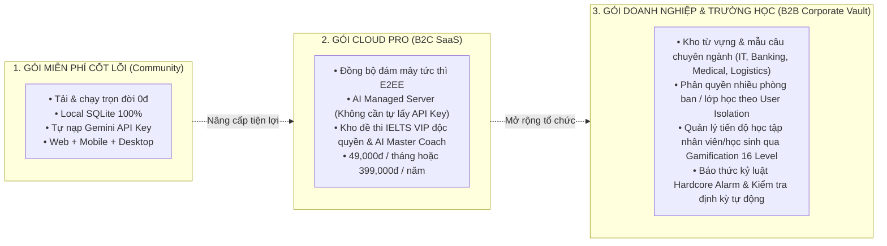

# 📊 LinguaVault - Business Strategy & Product Blueprint

> **Tài liệu Định hướng Chiến lược Kinh doanh, Nghiên cứu Thị trường, Mô hình Sản phẩm và Lộ trình Phát triển (Product & Business Strategy Document)**

---

## 📑 Mục Lục
1. [Tóm Tắt Điều Hành (Executive Summary)](#1-tóm-tắt-điều-hành-executive-summary)
2. [Phân Tích Thị Trường & Vấn Đề (Market Analysis & Pain Points)](#2-phân-tích-thị-trường--vấn-đề-market-analysis--pain-points)
3. [Chân Dung Khách Hàng Mục Tiêu (Target User Personas)](#3-chân-dung-khách-hàng-mục-tiêu-target-user-personas)
4. [Định Vị Sản Phẩm & Lợi Thế Cạnh Tranh (USP)](#4-định-vị-sản-phẩm--lợi-thế-cạnh-tranh-usp)
5. [Mô Hình Kinh Doanh & Chiến Lược Tạo Doanh Thu (Monetization Models)](#5-mô-hình-kinh-doanh--chiến-lược-tạo-doanh-thu-monetization-models)
6. [Chỉ Số Hiệu Suất Cốt Lõi (Key Performance Indicators - KPIs)](#6-chỉ-số-hiệu-suất-cốt-lõi-key-performance-indicators---kpis)
7. [Chiến Lược Tiếp Cận Thị Trường (Go-To-Market - GTM)](#7-chiến-lược-tiếp-cận-thị-trường-go-to-market---gtm)
8. [Lộ Trình Phát Triển Sản Phẩm (Product Roadmap)](#8-lộ-trình-phát-triển-sản-phẩm-product-roadmap)

---

## 1. Tóm Tắt Điều Hành (Executive Summary)

### 1.1 Tầm Nhìn (Vision)
Xây dựng **LinguaVault** trở thành **Hệ điều hành Tri thức Ngôn ngữ Cá nhân số 1 (The Ultimate Personal Language OS)**, nơi người học có toàn quyền sở hữu dữ liệu của mình (Local-First), xóa bỏ hoàn toàn rào cản chi phí subscription đắt đỏ thông qua việc tận dụng tối đa trí tuệ nhân tạo thế hệ mới (Google Gemini AI 0đ) và thuật toán lặp lại ngắt quãng SuperMemo SM-2.

### 1.2 Sứ Mệnh (Mission)
Giải quyết triệt để **đường cong lãng quên (Forgetting Curve)** của 95% người học tiếng Anh, chuyển hóa kiến thức thụ động thành phản xạ ngôn ngữ chủ động trong môi trường học thuật IELTS, công việc quốc tế và giao tiếp chuyên nghiệp.

---

## 2. Phân Tích Thị Trường & Vấn Đề (Market Analysis & Pain Points)

### 2.1 Bối Cảnh Thị Trường (EdTech & Language Learning)
- Thị trường học ngôn ngữ số toàn cầu ước tính đạt **trên 30 tỷ USD vào năm 2028**, với tốc độ tăng trưởng kép (CAGR) vượt 18%/năm.
- Xu hướng **AI-first Learning** và **Subscription Fatigue** (người dùng mệt mỏi với các gói thuê bao hàng tháng $10 - $35/tháng từ Duolingo Max, ELSA Speak, Quizlet Plus...) đang tạo ra làn sóng tìm kiếm các giải pháp tự chủ, hiệu quả cao và chi phí tối ưu.

### 2.2 Các Nỗi Đau Lớn Của Người Học (Key Pain Points)

| # | Vấn Đề Thực Tế | Hậu Quả Đối Với Người Học | Giải Pháp Của LinguaVault |
| :-: | :--- | :--- | :--- |
| **1** | **Học trước quên sau (Forgetting Curve)** | Học 1,000 từ vựng nhưng sau 1 tháng chỉ nhớ được < 15%. | Thuật toán **SuperMemo SM-2 SRS** tự động lập lịch nhắc ôn tập đúng thời điểm vàng trước khi não bộ quên. |
| **2** | **Công cụ phân mảnh, rời rạc** | Phải dùng Anki để ôn từ, Google Docs để ghi chú, Chatbot để sửa câu, app riêng để luyện nói. | **All-in-One Vault**: Tích hợp Kho từ vựng, Mẫu câu, Smart Reader, Quiz AI, Phòng luyện nói và Telegram Bot trên cùng 1 hệ sinh thái. |
| **3** | **Chi phí AI & Đăng ký đắt đỏ** | Trả $15–$30/tháng cho các gói AI sửa bài hoặc chấm nói. | Tích hợp **Google Gemini Flash-Lite 0đ**, cho phép người dùng tự nhập API Key miễn phí không giới hạn. |
| **4** | **Mất quyền sở hữu dữ liệu** | Khi app đóng cửa hoặc hủy sub, toàn bộ ghi chú và kho từ biến mất. | **Local-First SQLite**: Toàn bộ dữ liệu nằm trên máy người dùng, sao lưu/phục hồi JSON 1-click. |
| **5** | **Thiếu tính kỷ luật & Tương tác thực tế** | Dễ bỏ cuộc sau 1–2 tuần vì không có người đốc thúc. | **Telegram AI Copilot 2 chiều**: Báo thức Hardcore Alarm, gửi bài tập và đàm thoại luyện phản xạ mỗi ngày. |

---

## 3. Chân Dung Khách Hàng Mục Tiêu (Target User Personas)

```
                       +-----------------------------------+
                       |    KHÁCH HÀNG MỤC TIÊU CỦA        |
                       |          LINGUAVAULT              |
                       +-----------------+-----------------+
                                         |
         +-------------------------------+-------------------------------+
         |                               |                               |
         v                               v                               v
+------------------+           +-------------------+           +-------------------+
|     PERSONA 1    |           |     PERSONA 2     |           |     PERSONA 3     |
|   IELTS / GRE    |           |   KỸ SƯ & CHUYÊN GIA   |           |   POWER LEARNERS  |
|  Academic Hunter |           |   Working Global  |           |   Anki Emigrants  |
+------------------+           +-------------------+           +-------------------+
| • Mục tiêu: 7.0+ |           | • Lập trình viên, |           | • Người yêu thích |
| • Cần: Cấu trúc  |           |   quản lý sản phẩm|           |   cá nhân hóa     |
|   câu C1-C2,     |           | • Cần: Viết email |           | • Cần: Local-first|
|   Speaking Band  |           |   chuẩn, nói lưu  |           |   hiện đại, UI/UX |
|   chấm điểm AI   |           |   loát, thuật ngữ |           |   đẹp, AI hỗ trợ  |
+------------------+           +-------------------+           +-------------------+
```

---

## 4. Định Vị Sản Phẩm & Lợi Thế Cạnh Tranh (USP)

### Bảng So Sánh Cạnh Tranh Trực Tiếp

| Tiêu Chí Đánh Giá | LinguaVault | Anki | Quizlet | ELSA Speak | Notion / Obsidian |
| :--- | :---: | :---: | :---: | :---: | :---: |
| **Chi Phí Định Kỳ** | **0đ Vĩnh Viễn** | 0đ ($25 trên iOS) | $35.99 / năm | $100+ / năm | Miễn phí / $10/th |
| **Thuật Toán SM-2 SRS** | **Có (3 chế độ)** | Có | Bị giới hạn | Không có | Cần plugin ngoài |
| **Tích Hợp AI Trợ Lý** | **Gemini Flash 0đ** | Không | Trả phí cao | Trả phí cao | AI tính phí riêng |
| **Luyện Nói & Chấm IELTS** | **Có (AI Speaking Lab)**| Không | Không | Có | Không |
| **Telegram Bot Đàm Thoại**| **Có (2 chiều + Alarm)**| Không | Không | Không | Không |
| **Quyền Sở Hữu Dữ Liệu** | **100% Cục bộ SQLite** | Cục bộ | Trên mây | Trên mây | Tùy chọn |
| **UI/UX Hiện Đại & Dark Theme** | **Chuẩn Pro, Đa nền tảng** | Cổ điển, khó dùng | Hiện đại | Hiện đại | Hiện đại |

---

## 5. Mô Hình Kinh Doanh & Chiến Lược Tạo Doanh Thu (Monetization Models)

Mặc dù LinguaVault cốt lõi theo triết lý **Mã nguồn mở & Tự lưu trữ (Open-Core & Self-Hosted 0đ)**, dự án có tiềm năng thương mại hóa cực lớn thông qua các gói giá trị gia tăng sau:



---

## 6. Cơ Chế Gamification & Thúc Đẩy Động Lực (Retention Engine)

LinguaVault 2.0 tích hợp hệ thống trò chơi hóa (Gamification) chuẩn khoa học hành vi (Behavioral Science) để giải quyết triệt để vấn đề bỏ cuộc của người học:

### 6.1 Bậc Thang Cấp Độ 16 Level (The 16-Level Mastery Ladder)
Hệ thống phân cấp từ người mới bắt đầu đến học giả siêu cấp:
- **Hạng Đồng (Bronze)**: Level 1 (Novice Scholar, 0 XP) ➔ Level 4 (Grammar Apprentice, 600 XP).
- **Hạng Bạc (Silver)**: Level 5 (Vocab Builder, 1,000 XP) ➔ Level 8 (Pattern Artisan, 2,800 XP).
- **Hạng Vàng (Gold)**: Level 9 (Fluent Communicator, 3,600 XP) ➔ Level 12 (Lexical Master, 6,600 XP).
- **Hạng Kim Cương & Thần Thoại (Diamond & Mythic)**: Level 13 (IELTS Virtuoso, 7,800 XP) ➔ Level 16 (Ascended Polyglot, 12,000+ XP).

### 6.2 Chu Kỳ Kỷ Luật Thép (Hardcore OS Alarm & Streak Guard)
- **Báo thức Hardcore Alarm**: Kêu liên tục trên loa hệ thống và điện thoại, chỉ tắt khi người học hoàn thành đúng 100% nhiệm vụ giải đề ngắn.
- **Streak Shield & XP Multiplier**: Duy trì chuỗi ngày học liên tục để nhận thưởng hệ số nhân EXP x1.5 và x2.0.

---

## 7. Chỉ Số Hiệu Suất Cốt Lõi (Key Performance Indicators - KPIs)

### 7.1 Chỉ Số Trải Nghiệm Học Tập (Learning & Retention Metrics)
- **Retention Rate D30**: Tỷ lệ người học duy trì việc ôn thẻ SRS sau 30 ngày (Mục tiêu: > 45%, so với mức trung bình ngành 15%).
- **Mastery Transition Rate**: Tỷ lệ từ vựng và mẫu câu chuyển dịch từ trạng thái `New` ➔ `Learning` ➔ `Mastered` (> 70% sau 60 ngày).
- **Streak Maintenance**: Thời lượng duy trì chuỗi học liên tục trung bình của người học (> 14 ngày).

### 7.2 Chỉ Số Kỹ Thuật & Hiệu Năng (Technical KPIs)
- **AI Latency**: Tốc độ sinh đề thi và chấm điểm của AI giữ vững ở mức **< 3.5 giây/lần**.
- **System Uptime & Stability**: Tỷ lệ bài test tự động đạt **100% (26/26 Pass)** trên mọi bản build phát hành.
- **Data Loss Rate**: **0.00%** nhờ cơ chế ghi đĩa trực tiếp SQLite (WAL Mode) và sao lưu định dạng chuẩn JSON.

---

## 8. Chiến Lược Tiếp Cận Thị Trường (Go-To-Market - GTM)

1. **Giai đoạn 1: Thu hút Cộng đồng Kỹ Sư Công Nghệ & Power Users (Developer Community)**:
   - Chia sẻ mã nguồn và bài viết phân tích kiến trúc Local-First + SM-2 + Gemini 0đ trên GitHub, Dev.to, Viblo, diễn đàn Lập trình viên.
   - Nhắm vào nhóm đối tượng IT cần học tiếng Anh giao tiếp và viết tài liệu kỹ thuật.
2. **Giai đoạn 2: Tiếp cận Cộng đồng Luyện Thi IELTS & Học Thuật (Academic Expansion)**:
   - Hợp tác với các giáo viên, trung tâm IELTS để phân phối các bộ dữ liệu mẫu câu Band 7.5–9.0 dựng sẵn trên LinguaVault.
   - Chiến dịch *"Nói không với Subscription $20/tháng - Làm chủ kho học tập của riêng bạn"*.
3. **Giai đoạn 3: Viral qua Tính năng Telegram AI Copilot & Hardcore Alarm**:
   - Khuyến khích người dùng kết nối Telegram Bot để nhận báo thức ôn bài, chia sẻ tiến độ học tập lên mạng xã hội.

---

## 9. Lộ Trình Phát Triển Sản Phẩm (Product Roadmap)

```
2026 Q1 - Q2 (HOÀN TẤT) ────────► 2026 Q3 (ĐỒNG BỘ & CHIA SẺ) ──► 2026 Q4 (ĐA NGÔN NGỮ) ──► 2027 (B2B PLATFORM)
• Full Stack Web + Mobile + Desktop   • Cloud Sync mã hóa đầu cuối E2EE   • Mở rộng tiếng Nhật (JLPT N1-N5)  • B2B Dashboard cho Công ty
• Thuật toán SRS SM-2 chuẩn           • Community Shared Decks Hub       • Mở rộng tiếng Trung (HSK 1-6)    • Team Vocabulary Repository
• Gemini Flash-Lite AI Generator      • P2P WebRTC Local Sync             • Phân tích ngữ điệu giọng đa vùng • API tích hợp LMS trường học
• AI Speaking Lab & Telegram Copilot  • Widget iOS / Android HomeScreen
```

---

## 📄 Kết Luận
**LinguaVault** sở hữu sự kết hợp hoàn hảo giữa **nền tảng khoa học vững chắc (SuperMemo SM-2)**, **công nghệ AI tối tân thế hệ mới (Gemini Flash-Lite)**, **bộ phát âm giọng bản xứ Apple Siri Native**, và **mô hình kiến trúc Local-First an toàn tuyệt đối**. Đây là giải pháp đột phá, có khả năng định nghĩa lại cách con người tiếp thu, ghi nhớ và làm chủ một ngôn ngữ mới trong kỷ nguyên số.

